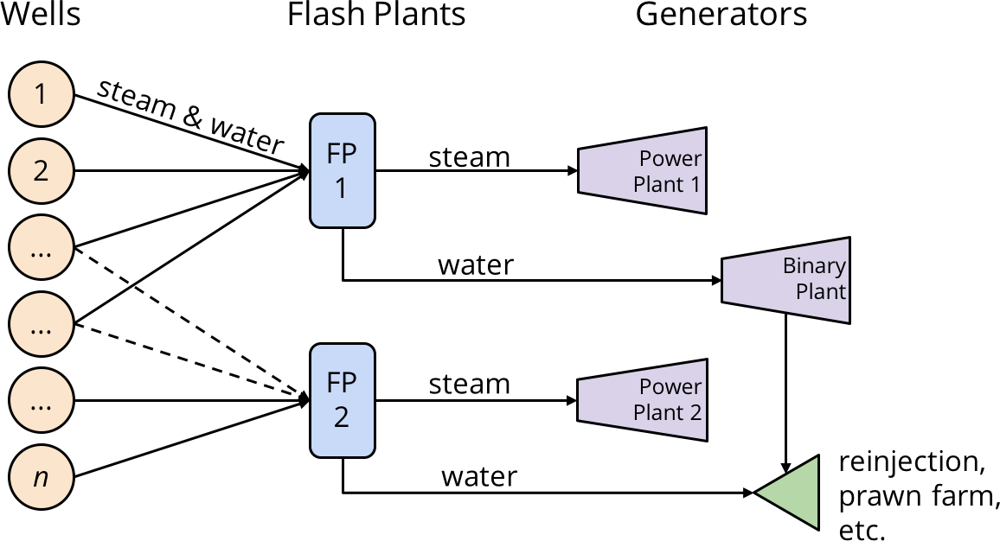

--- 
title: "Wairakei Stochastic Simulation Research Compendium"
author: "Logan Wu"
date: "`r Sys.Date()`"
site: bookdown::bookdown_site
github-repo: "loganbwu/geothermal"
output:
  bookdown::gitbook:
    css: "css/mine.css"
    includes:
      in_header: "header.html"
    config:
      toc:
        collapse: section
        scroll_highlight: yes
        after: |
          <li><a href="https://engsci700-2018.blogs.auckland.ac.nz/lwu308-logan-wu/">
          Wordpress Page</a></li>
          <li><a href="https://github.com/loganbwu/geothermal/commits/">
          Commit Logs</a></li>
      sharing: no
description: "Compendium index for the ENGSCI Part IV research project"
output_dir: "../docs"
---

# Overview {-}

This compendium contains all the material used to generate the final report. It is automatically generated thanks to Bookdown and Rstudio. (I swear, it only took a few hours to convert my source code into this.)

All items presented were developed independently by myself for my half of the project.

Compilation requires data in `(root)/wairakei_data/*.xlsx`, i.e., you won't be able to run any of the code but it's been pre-run for you. Raw data is confidential - contact Contact for access. The config file `/wairakei_data/config.xlsx` also may contain confidential data and is not committed, as is the entire `/wairakei_data/` folder.

## Components {-}

- **\@ref(motivation) [Motivation]** Basically an exec summary. Used as the draft for my Wordpress page.
- **\@ref(research-journal) [Research Journal]** Meeting notes and emails.
- **\@ref(initial-plots) [Initial Plots]** Recreation of the provided Excel worksheet.
- **\@ref(python-extraction-code) [Python Extraction Code]** Exploratory analysis and process data to a config and data spreadsheet.
- **\@ref(r-jags-and-rjags) [R, JAGS, and RJAGS]** Takes the data from the config/data sheets and format into JAGS input. Then post-processes the output. This is the program used to create the report outputs.
- **[Special Thanks]** Just a few of the people who made this possible.
- [**Wordpress Page**](https://engsci700-2018.blogs.auckland.ac.nz/lwu308-logan-wu/) Requires a "subscription" to the ENGSCI700 2018 blogs to view.
- [**Commit Logs**](https://github.com/loganbwu/geothermal/commits/) Version history.

## Non-components {-}

(Not included)

- **Data** So that this compendium can be uploaded to Github without paying for a private repo.
    + **2486** rows of mass flow / whp data from multiple sources.
    + **420** rows of time-series mass flow data from PI.
    + **74.5** MB of spreadsheets from Contact that have crashed my computer many times.
- **Raw Outputs**
    + **456** MB of output traces -- 10,000 samples of 5654 variables.
    + **Blood**, sweat and tears, which do not aid the communication of my work.

{width=400px}

<!--chapter:end:index.Rmd-->

# Motivation

## Introduction

Geothermal power makes up 13% of New Zealand's electricity supply, going all the way back to 1958. The Wairakei field's current operator, Contact Energy Ltd., gathers a huge amount of data for the purposes of monitoring the state of the field.

Traditional data management tools (SCADA) give point measurements, which are fed into an Excel model of the steamfield. However, all measurements and models have errors. By ignoring uncertainty, we make ourselves oblivious to the risks posed by randomness and cannot quantify our own uncertainty in our estimates.

## Background

At Wairakei, there is a unique and complex network of facilities that make it possible to generate power under difficult conditions. Wells draw mixed-phase fluid from the reservoir to the surface, where it is separated by flash plants. The resulting steam and water is sent to generators, reinjected or discarded.

Not every flow, temperature or enthalpy can be measured everywhere in the network. Some parameters are calculated, and then used to estimate the state of the network. Live, accurate knowledge of the steamfield is vital for operational decisions such as when to do maintenance, or how to ensure the longevity of its natural resources.

## What are we doing?

[Bayesian statistics](https://en.wikipedia.org/wiki/Bayesian_inference) and [Monte Carlo simulation](https://en.wikipedia.org/wiki/Monte_Carlo_method) are two methods that go hand in hand to incorporate uncertainty in our predictions.

Our implementation in R provides graphical interpretations of the model's outputs. The model is fully configurable using an Excel tool, and automatic diagnostic tests verify that it is operating correctly.

## Outcomes

We iterated through a variety of model formulations and methods, settling on the one with the best performance. Our program also generates interactive plots of the results, allowing the operator to filter by facility and compare the performance of their assets.

We also evaluate the risk of the steamfield exceeding any constraints, such as steam flow limits.

- **Quick Runtime** Execution of data ingestion, simulation, and outputs in less than five minutes. The current workflow takes hours.
- **Intuitive Results** Density plots show our estimates and uncertainties. Risks of constraint violations are also easy to interpret.

## Results

- **Limitplot** We simulated an actual Contact Energy configuration. The steam flows are  unlikely to exceed the flash plant limits, shown as the red lines. This confirms that their configuration is not risky.

<!--chapter:end:01-motivation.Rmd-->

# Research Journal

Here are the notes I took from our meetings. They kind of peter out by the end, but the length of the notes is inversely proportional to the amount of work I did that week.

This journal contains some email transcripts between David Dempsey and Contact.

## March 8th

**Notes**

-	Familiarise with spreadsheet
-	Find examples of forecasting, optimisation and stochastic simulation in oil & gas industry
-	Choose part of project

Documents used:

-	Fifty years of geothermal power generation at Wairakei
-	AEE - 104706 Take Variation Appn 2017_final.pdf
-	contact_email_instructions.pdf
-	Liquid wells (version 1).xlsx
-	Wairakei Tauhara Draft SMP May 2016.pdf
-	WK TH 2016 Annual Report FINAL.pdf

**Notes**

-	Excel spreadsheet is missing links to SteamTab.xla
-	Some things will take a long time to understand without knowing the original formula. See 'WK26A'!K12 – maybe if I wrote it out replacing all the cell references with column names I could work it out, but there's also all the constants. Not sure if it's a good use of time to understand the physics.
-	Also, there are slight inconsistencies I don't understand. For example, see 'WK26A'!O12 and 'WK26A Trend'!I10. I expected these to be the same data point.
-	Propose doing proof of concept in something else to better facilitate visualisation, optimisation and simulation. Suggest R or Python (no personal preference). Could use SQL but probably overcomplicating. Should be easy to move to Excel afterwards.
-	I do not mind which part I do. Here are the pros and cons of me doing each part:

|  | Optimisation | Simulation |
|------|---------------------------------------------------------------------------------|----------------------------------------------------------------------------|
| Pros | - ENGSCI 355 linear programming - Have programmed heuristics (ENGSCI 255 & 760) | - STATS 731 Bayesian Inference - Have programmed simulations in C++/Python |
| Cons | - Don’t understand the spreadsheet - Haven’t yet found examples | - Don’t yet understand the energy extraction process |

## March 16th

**Meeting**

-	Model wk255: inputs and outputs. Create Python script to extract data and replicate plots. Then generalize to other sheets
    + Plots: $\dot{m} = f(P_\text{whp})$ and $\dot{m} = f(t | P_\text{whp})$
-	$\dot{m} = f(P_\text{whp})$. Inputs: Well-head pressure, outputs: linearly declining res $P$ to predict mass flow in future 
-	Look at using regression uncertainty to create a distribution of future mass flows
-	Make reasonable assumptions
-	Missing data points are not important
-	Maybe use Jupyter notebook?

**Notes**

-	Done linear regression on data

## March 23rd

**Meeting**

-	Need to fit elliptic curve
-	Make sure it generalises to all wells
-	Input function for making predictions. $\dot{m} = f(\text{well}, \text{whp}, \text{date})$
-	Road trip!! To see all there is to see in Wairakei. Second week of break, sometime April 12th-15th?

**Meeting** with Julian March 28th

Operations

-	Decline rate done by operator (Christine). Can indicate if something happened in the well (e.g. scaling) to cause observed long-term changes in the decline rate
-	A workover (de-scaling) increases mass flow and pressure
-	Separation pressure determines the fraction of steam and fluid in the mass flow, where $\dot{m} = f(P_\text{sep})$. Christine may explain why all the inconsistent equations.
-	Begin by looking at one or two flash vessels and calculating enthalpy.
-	(Out-of-scope) considerations could also include variability in power prices (affects objective) and air temperature (affects efficiency).
-	One goal (objective function) is to get less brine as a proportion of mass flow.
Data
-	Well numbers indicate age (lower numbers are older) – wells from similar periods will act similarly
-	'PI' sheet: gives whp. 'Equation' sheet: gives decline rates
-	Try to extract data into Python for a more readable form? [Note: crashed my laptop trying to do this and haven't tried again yet – Logan]
Mathematical modelling
-	Try to predict what decisions would be made
-	Predict causes of pressure decline (e.g. decision tree / tree classifier) e.g. local scaling, global pressure drawdown
-	Make a new spreadsheet (General Projection [note: can't remember what this was])
-	Enthalpy: Maybe just do a user-controlled constant (as indicated by no trend in the enthalpy graphs). Also make mass flow / enthalpy decline rate manual from regression. It can change periodically.
-	Create a well operating schedule and predict steam flow.
-	WHP → mass flow → steam flow → enthalpy → power. Predict for one year and optimise steam flow s.t. total mass constraints. Discretise over large time periods (e.g. 3 months to begin)

**Notes**

-	Modify regression and plots to operate on multiple wells simultaneously
-	Remove formulae from Generation Projection spreadsheet to make it run faster 

## April 12th

**Meeting** with Contact in Taupo

**Current State**

-	GE (General Electric) is currently working on a similar project which includes trading – out of scope for us. CSV-formatted data has been made available to them and has been requested for us.
-	Well test data comes from two sources: bore tests and tracer flow tests (TFTs). Bore tests are denoted by three simultaneous data points and are expensive. TFTs are identified by a single test on a day, and are run under normal operating conditions.
-	Liquid wells regression is satisfactory in its current state. Modifying to fit w269 is unnecessary right now.
Modelling
-	Validation (regression): check that mass flow predictions match TFTs. N/A, we use the TFTs in the regression training set.
-	Validation (model): check that flow meters downstream from FPs matches FP input flows.
-	Variables (well head pressure): whp is not a decision variable. It is usually taken from the most recent TFT, representing full load.
-	Variables (enthalpy): h is often independent of whp in watery wells, but confirm for all wells in use before going forward with a constant. h also has variability, so confirm with the FP in case there are any short-term fluctuations.
-	Constraints (consent): bioreactor (did I hear this correctly?) limits, mass limits, temperature (heat energy) limits, temporal limits
-	Constraints (physical): FP min/max h, network connectivity, LP/IP FP capacity
-	Scope: For actual optimisation, the entire system (e.g. including Te Mihi) has to be considered because it is all interconnected.

**Decisions**

-	Workover: whether to do a workover (out of scope or later on)
-	Flipping: which plant to send a well to. High h wells are usually sent to Te Mihi, ranked in order of h. Flips only happen when turning a well on (not one that is already running).
-	Well on/off: in general, almost all wells are used.

**Objectives**

-	Maximise power
-	Minimise wasted mass from disk blowout events (difficult to quantify because there are random system trips)

## April 26th

**Meeting**

- Make one-day plan
- Lit review: Don't expect 10 pages/30refs
- WHP: More realistic one might take varying whps.

**Notes**

-	What about a greedy heuristic / complete enumeration? Would make it easier to do the stochastic simulation if every component is represented by an object
-	Resource consent?
-	Get all the data
-	Split tasks
-	What constraints exist? Chemical/mass/physical(fractions)
-	Data for each well on chemicals
-	Parasitic power needs
-	Confints/prior dists

**Questions**

- The project is focusing in on flash plants 14, 15, and 16:
    +	What constraints are there on the maximum mass flows entering these plants? (for instance, they presumably couldn't handle a million tons per hour...)
    +	What constraints are there on steam flow exiting the plant? Condensed water?

> The current steamflow limit of the vessels:
>
> + FP14 - 525 t/h
> + FP15 - 775 t/h
> + FP16 IP - 420 t/h
> + FP16 IP+ - 450 t/h
    
- The tools used to monitor mass flow in and out of the flash plants:
    + What uncertainty is attached to these measurements? \(\pm\) 1%? 10%? 0.01%?
    
> in terms of value, 10% is acceptable; in terms of trend, it has to be 100% accurate

- What change in mass flow is required to trip the automatic data logger, so that it begins recording a new value? (I forgot the name of this system...) 
    
> we don't have this and I have never heard of this. We do the accuracy check manually using spreadsheets
    
- Regarding the power plants (Wairakei, Te Mihi and Poihipi):
    + We have some numbers for the conversion factor from steam to MW – what uncertainty is attached to these? \(\pm\) 5%?
    
> Yes the changes to this number is up to 5%, although this number if often calibrated with actual values.

- Does it depend on the time of year (ambient temperature)?

> No, we do a different correction for ambient temperature and seasonal changes

- What constraints are there operating the power plants? I remember discussing that turbines were MW rated and you couldn't go much above the rating – how much above?

> The max MWE is the equivalent of the steamflow limits

- Regarding the TFT and well test measurements:
    + What level of confidence/uncertainty would you attach that these numbers are correct?
    
> $\pm$ 5%-10% is acceptable as long as the trend is similar

-  Do you know if these are publically available? We have been unable to find them. 

> Maybe not. I will confirm with Warren

## July 19th

- Well MFs are calculated. Only FP mass flows are measured

## August 9th

-	Verify Bayesian with analytic calculations

**Questions**

- Can I please confirm there are only steam flow limits on flashplants 14, 15 and 16? not any water flow limits?

> The limits of the flash plants are specified in terms of steamflow values and not in water flow. This means that if the wells become watery overtime, there will be a lot of excess water flow to be dealt with when fully loading the vessels.
 
- With FP16 we have been given limits for FP16 IP and IP+, I can see from the steamfield schematic diagram that it seems as though some wells feed to FP16 IP and some to FP16 IP+ and then some also goes from FP16 IP+ to FP16 IP. Would it be possible to get a bit more an explanation as to how this works, I can't seem to discern anything from the 'Data for AU' spreadsheet provided, this spreadsheet seems to just treat it as one FP.

> Te Mihi can be a 3-flash system or a 2-flash system.
> If configured as a 3-flash system: 
>
>  1.	FP16ip+ having the highest separation pressure 
>  2.	FP16 IP & FP15 IP second highest 
>  3.	LP vessels. The water from IP+ will join the mass going to FP16 & FP15, and then the water from the latter will go to the LP vessel.
> 
> If configured as a 2-flash system, IP+ water will join the water coming out from FP16 & FP15 . The combined water will go to the LP vessel.

- How do we determine the amount of steam going to Poihipi, from the 'Data for AU' spreadsheet it seems that wells 253, 258, 259, 260 go to Poihipi, but without clarification on the question above I am unsure about this.

> Steam going to Poihipi will be the steam from IP+, which is NOT ONLY WK253 WK258 WK259 WK260 but also the swinging wells WK270 WK271 WK272 WK245 WK263 WK264 WK265 if they are swung to Te Mihi/ip+.
 
- On the schematic diagram there is a well numbered 249 that isnt in the 'Data for AU' spreadsheet and conversely there is a well 238 on the 'Data for AU' spreadsheet that isnt on the schematic.

> WK249 has never been used due to high gas. WK238 is actually in the schematic diagram (above WK247 in figure below), although I am not sure if we are referring to the same diagram.
 
- If there is a way to determine how much water goes from FP14 to the binary power plant, for example is it a set proportion of the water, or a set number of tonnes per hour?

> That water should be the total water flow coming out from the LP vessel, which will be dictated by the LP vessel limit. As already provided to you, FP14 LP vessel is limited to 120t/h from 15Mar2018. Prior to 15Mar18, the limit was 40t/h. Water in excess of the LP vessel limit is not included in the calculation for the flow to the binary. I would also like to add a new limit to the FP14 total IP SF=525 t/h.

## August 16th

**Meeting**

- Things for report:
    + discussion of recommendation and model
    + discussion of internal and external considerations/factors

## September 6th


## September 13th

**Meeting**

- Switch data to before Dec 1st and make predictions. There is a difference between predicting with PI data and predicting with production curves.
- Compare TS models and predictions
- Narrow down problem wells
- Screenshots of user interface

<!--chapter:end:02-journal.Rmd-->

# Initial Plots

```{r plotsetup, include=FALSE}
knitr::opts_chunk$set(echo = TRUE, cache=TRUE, warning=FALSE)
library(tidyverse)
library(readxl)
library(extrafont)
library(lubridate)
library(viridis)
library(plotly)
library(htmlwidgets)

datapath = '../wairakei_data/plotdata.xlsx'
regdatapath = '../wairakei_data/data.xlsx'
base_year = '2000'
base_datetime = as.POSIXct(paste(base_year, 1, 1, sep='-'))

WK_fit = read_excel(datapath, 'WK261')
regression.df = read_excel(regdatapath, 'data') %>% filter(well=="wk261")
```

Contact gave us a spreadsheet of the test data, including a series of plots for each well. The spreadsheet is not included here, but we recreated it in R to ensure we understood how the spreadsheet analysis worked.

## Production Curves

```{r contactplot, fig.cap="Contact's current production curve modelling method."}
plotdata = regression.df %>%
  mutate(date_numeric = as.numeric(date - base_datetime)) %>%
  mutate(date_numeric=ifelse(date_numeric>0, date_numeric, NA)) %>%
  mutate(datetime = factor(as.Date(date))) %>%
  group_by(round(date_numeric,-2)) %>%
  filter(n()>2) %>%
  mutate(mf2 = mf^2)
  
mylm = lm(mf2 ~ datetime * I(whp^2) + datetime +0, data=plotdata)
datetime = plotdata$datetime %>% unique()
whp = seq(0, 16, 0.01)
reglines = expand.grid(datetime=datetime, whp=whp)
reglines$mf2 <- unname(predict(mylm, reglines))
reglines$mf <- sqrt(reglines$mf2)
reglines$date = as.POSIXct(reglines$datetime)

shifts = as.vector(mylm$coefficients[1:6])

curveplot = ggplot(plotdata, aes(x=whp, y=mf, color=date)) +
  geom_point() +
  # ggtitle('Production Curves from Multiple Bore Tests (10.7 bar)') +
  xlab('Well-head pressure (bar)') + ylab('Mass flow (T/h)') +
  xlim(c(0, NA)) + ylim(c(0, NA)) +
  guides(color=F) +
  geom_line(data=reglines, aes(linetype=datetime)) +
  labs(color="Date", linetype="Fitted curve") +
  ggsave("../media/wk261_production.png", width=8, height=8, units='cm')
ggplotly(curveplot)
saveWidget(ggplotly(curveplot), "curveplot.html")
```

They fit an independent curve for each series of bore tests with at least three data points. We think we can do one better by treating time as a variable rather than fitting separate models. This will allow us to consider all of the data even if there was only a single test (e.g., tracer flow tests), and reduce the impact of outliers.

## Decline

Then, we can estimate the decline rate of each well. Currently, Contact takes one point from each curve at a standard well-head pressure.

```{r decayplot, fig.cap="Comparison of independent curves and multiple curves."}
decay = reglines %>%
  filter(abs(whp-10.7) < 1e-3) %>%
  mutate(Method="Contact") %>%
  select(date, mf, Method) %>%
  rbind(WK_fit %>% mutate(Method="Multiple GLM"))

decayplot = ggplot(decay, aes(x=date, y=mf, color=Method)) +
  geom_point() +
  geom_smooth(method="lm") +
  facet_grid(~Method) +
  labs(title="Estimated Well Decay at 10.7 Bar", x="Date", y="Standardised mass flow", color="Data")
decayplot
```

This plot shows that the two methods give different slopes, or decay rates. Therefore, by excluding some of the data, it is possible that Contact is losing some performance in their model.

<!--chapter:end:03-plots.Rmd-->

# Python Extraction Code

```{r pysetup, include=FALSE}
knitr::opts_chunk$set(echo = TRUE, cache = TRUE, warning=FALSE)
library(reticulate)
library(lemon)
library(knitr)
library(kableExtra)
library(tidyverse)
library(DT)
```

The following data extraction and cleaning code is from `simulation.ipynb`. This file used to be where I did exploratory analysis of the data and tried some models. Further Python code for the model and analysis was later ported to R so has not been included.

The Python notebook is also used to generate a rudimentary config file, which I later added additional data to (note to self: don't run it or it will overwrite!). It seems that now Rmarkdown nicely integrates Python, [but the Reticulate package was only released in August 2018](https://cran.r-project.org/web/packages/reticulate/index.html). Oh well. I've put the Python code in here so technically, if I ran this notebook right this moment, it would do it all.

## Pre-processing

(Unix) Launch with

```
cd src
jupyter notebook
```

**Notes**

- `read_binary_solution` is able to read from Vida's outputs and turn it into a well/FP mapping. However I don't use it now because she doesn't map all of the wells. Instead I manually enter it from `Data for AU.xlsx`.
- Here we read in the Liquid Wells spreadsheet. My script manages to pick up at least 30 of the approx. 60 wells in here, but I manually copy/pasted the rest because it was too annoying.
- The network structure and parameters are read from a config spreadsheet, `config.xlsx`. I generate as much as I can automatically and then fill any gaps manually.
- The AIC for the linear model (the one I eventually used) is the lowest. This backs up the DIC figures I came up with for the Bayesian model later.

```{python, results="asis"}
import pandas as pd
import numpy as np
import seaborn as sns
from datetime import datetime, timedelta
import matplotlib.pyplot as plt
from matplotlib.colors import Normalize
from matplotlib.colorbar import ColorbarBase
from IPython.display import display, HTML
import itertools
import os
import pyjags
import warnings

base_year = '2000'    # numeric dates calculated from Jan-01
configpath = '../wairakei_data/config.xlsx'

def read_binary_solution(path='../wairakei_data/toy-network-v4.xlsm'):
    # read from Vida's toy model workbook
    xlfile = pd.ExcelFile(path)
    sheet = xlfile.parse('Full LP')
    sheet = sheet.loc[sheet.count(1)>50]  # arbitrary, anything works
    sheet = sheet.transpose()
    sheet.columns = ['used', 'combination']
    combinations = pd.DataFrame([x.split('-') for x in sheet.query('used==1')['combination']],
                               columns = ['well', 'fp'])
    combinations['well'] = 'wk' + combinations['well']
    combinations['fp'] = 'fp' + combinations['fp']
    return(combinations)

def myprint(df):
    display(HTML(df.to_html()))
    
def central(data, m=3.29):
    return data[abs(data - np.mean(data)) < m * np.std(data)]

def rename_wk(names):
    # fix 'WK' inconsistencies
    new = names.str.lower()
    new = new.str.replace("^[^\d]*", "wk")
    new = new.str.strip()
    return new
    
def datetime_to_numeric(my_datetime):
    # returns days since base_year-01-01.
    try:
        # datetime implem
        date_numeric = (my_datetime - datetime(int(base_year),1,1)) / timedelta(days=1)
    except:
        # numpy implem
        date_numeric = (my_datetime - np.datetime64(base_year)) / np.timedelta64(1, 'D')
    return date_numeric

# Check if Excel file is already in memory (loading is slow)
try:    xl
except: xl = pd.ExcelFile('../wairakei_data/Liquid wells (version 1).xlsx')
sheetlist = [x for x in xl.sheet_names if set(x) & set('FtT(L') == set()]
print("Sheets:", ', '.join(sheetlist))

# sheets to load data from
sheets = ['wk255', 'wk256']

dfs = []
for sheet in sheets:
    try:
        df = xl.parse(sheet)  # select well data
        df['well'] = sheet    # label data with well name
        dfs.append(df)
    except:
        print('Failed on sheet', sheet)
df = pd.concat(dfs)

df = df[['date', 'whp', 'mf', 'h', 'well']]           # only keep certain columns
df['well'] = rename_wk(df['well'])
df['mf'] = pd.to_numeric(df['mf'], errors='coerce')   # remove 'dummy' entries
df = df.dropna(subset=['date', 'whp', 'mf'])          # remove NA
df['date_numeric'] = datetime_to_numeric(df['date']) #  yrs since base_year
df = df.reset_index(drop=True)
wells = df['well'].unique()
print(df.head())

regression_df = df.reset_index(drop=True)
wells = regression_df['well'].unique()
print(wells)

# import and process data
try:    fpxl
except: fpxl = pd.ExcelFile('../wairakei_data/Data for AU.xlsx')
    
fpdf = pd.read_excel(fpxl, 'calculation', header=1, usecols="D:E, J:L, N:P")
fpdf = fpdf.rename(columns={"FP15": "well", "Unnamed: 1": "fp",
                            "hf": "hf_ip", "hg": "hg_ip", "hfg": "hfg_ip",
                            "hf.1": "hf_lp", "hg.1": "hg_lp", "hfg.1": "hfg_lp"})
 # make sure it has the necessary data
fpdf = fpdf[pd.to_numeric(fpdf['hf_ip'], errors='coerce').notnull()]
for col in ['well', 'fp']:
    fpdf[col] = fpdf[col].str.lower()
fpdf[fpdf.columns] = fpdf[fpdf.columns].apply(pd.to_numeric, errors='ignore')
print(fpdf.head())

def write_config(configpath):
    # only use if it gets lost. Will refresh file
    well_fp_map = pd.DataFrame({'well': ['wk27', 'wk242', 'wk247', 'wk253', 'wk254',
    'wk255', 'wk256', 'wk258', 'wk259', 'wk267', 'wk268', 'wk269', 'wk270', 'wk271', 'wk272'],
                                'fp':   ['fp1',  'fp14',  'fp15', 'fp16',  'fp16',
                                'fp15',  'fp15',  'fp16',  'fp16',  'fp16',  'fp16',
                                'fp15',  'fp15',  'fp14',  'fp14']},
                               columns=['well', 'fp'])
    fp_gen_map = pd.DataFrame({'fp':     ['abandoned', 'poi dry', 'direct ip', 'fp1',
                               'fp14', 'fp15', 'fp16', 'fp2', 'fp4', 'fp5', 'fp9-10'],
                               'gen_ip': [ None,       'POI',      None,       'WRK',
                               'WRK',  'THI',  'POI',  'WRK', 'WRK', 'WRK', 'WRK'   ],
                               'gen_lp': [ None,       'POI',      None,       'WRK',
                               'WRK',  'THI',  'POI',  'WRK', 'WRK', 'WRK', 'WRK'   ],
                               'gen_w':  [ None,        None,      None,       'BIN',
                               None,   None,   None,  'BIN', 'BIN', 'BIN', 'BIN'   ]},
                              columns=['fp', 'gen_ip', 'gen_lp', 'gen_w'])
    gen_constants = pd.DataFrame({'gen':    ['WRK', 'THI', 'BIN', 'POI' ],
                                  'ip':     [ True,  True,  False, True ],
                                  'lp':     [ True,  True,  False, True ],
                                  'bin':    [ False, False, True,  False],
                                  'factor': [ 9.2,   8.22,  178.9, 7.76]},  # m3/MW
                                 columns=['gen', 'ip', 'lp', 'bin', 'factor'])
                                 
    # find details of the last known operating conditions
    last_idx = regression_df.groupby('well')['date_numeric'].idxmax()
    operating_conditions = regression_df.iloc[last_idx][['well', 'whp', 'h']]

    # set constants (could use median)
    fp_constants = fpdf.groupby('fp').mean().reset_index()

    if os.path.exists(configpath):
        os.remove(configpath)
    config_writer = pd.ExcelWriter('../wairakei_data/config.xlsx')
    print("Writing config data to", configpath)
    configdata = {'well_fp_map': well_fp_map,
                  'fp_gen_map': fp_gen_map,
                  'operating_conditions': operating_conditions,
                  'fp_constants': fp_constants,
                  'gen_constants': gen_constants}
    for sheetname, df in configdata.items():
        df.to_excel(config_writer, sheetname, index=False)
    # config_writer.save() # Don't overwrite!
    return pd.ExcelFile(configpath)

try:
    config = pd.ExcelFile(configpath)
except FileNotFoundError:
    print("Warning: are you sure you want to overwrite the config file?")
#     config = write_config(configpath)

## Exploratory Analysis
import itertools

cmap = plt.get_cmap('viridis')
fig, (ax1, ax2) = plt.subplots(1,2, figsize=[14,4])
fig.tight_layout() #spreads out the plots

# left plot (not that useful tbh)
df.plot('date', 'whp', style='x', ax=ax1)
ax1.set_xlabel('date')
ax1.set_ylabel('whp')

# right plot (different colours represent time)
marker = itertools.cycle(['o', ',', '+', 'x', '*', '.'])
for well in wells:
    plt.scatter('whp', 'mf', c='date_numeric',
    data=df.loc[df['well']==well], marker=next(marker), label=well)
ax2.set_xlabel('whp')
ax2.set_ylabel('mf')
plt.legend()

plt.show()

## Set up regression data and create prediction frame for plotting
date_pred = np.arange(df['date'].min(), df['date'].max(),
        np.timedelta64(365*2, 'D').astype(datetime))
date_numeric_pred = datetime_to_numeric(date_pred)
whp_pred = np.linspace(0, 16, 1000)
well_pred = wells
pred = pd.DataFrame(list(itertools.product(date_numeric_pred, whp_pred, well_pred)),
                    columns=['date_numeric', 'whp', 'well'])
print(pred.head(3))

## Perform regression and prediction
from statsmodels.formula.api import ols

# Not conditioned on date
model1 = ols("mf ~ well * whp", data=df)
results1 = model1.fit()
pred['mf1'] = results1.predict(pred)

# Linear fit dependent on date
model2 = ols("mf ~ well * (whp + date_numeric)", data=df)
results2 = model2.fit()
pred['mf2'] = results2.predict(pred)

# Elliptic fit dependent on date
model3 = ols("np.power(mf,2) ~ well * (np.power(whp,2) + date_numeric)", data=df)
results3 = model3.fit()
pred['mf3^2'] = results3.predict(pred)
pred.loc[pred['mf3^2'] < 0, 'mf3^2'] = np.nan    # remove invalid results
pred['mf3'] = np.sqrt(pred['mf3^2'])

print(pred.head(3))

# ===============================================================
# Set up axes
# ===============================================================
# colors
cmap = plt.get_cmap('viridis')
indices = np.linspace(0, cmap.N, len(df))
my_colors = [cmap(int(i)) for i in indices]

# subplots
fig, (ax1, ax2, ax3, ax4) = plt.subplots(1, 4, figsize=[14,4],
        gridspec_kw={'width_ratios': [9,9,9,1]})
ax1.get_shared_y_axes().join(ax1, ax2, ax3)
ax1.set_ylim([0, 1000])
ax1.set_xlim(0, 16)
ax1.set_ylabel('Mass flow')
ax1.set_xlabel("Well head pressure")
ax1.set_title('$mf \sim whp$')
ax2.set_title('$mf \sim whp + date$')
ax3.set_title('$mf^2 \sim whp^2 + date$')

# create date colorbar
indices = np.linspace(0, cmap.N, len(date_pred))
my_colors = [cmap(int(i)) for i in indices]
norm = Normalize(np.min(df['date']).year, np.max(df['date']).year)
cb = ColorbarBase(ax4, cmap=cmap, norm=norm, orientation='vertical')
cb.set_label('Year')
linestyles = itertools.cycle(('-', '--', '-.', ':'))
marker = itertools.cycle(['o', ',', '+', 'x', '*', '.'])

# ===============================================================
# Plot data
# ===============================================================
# plot raw data points
for well in wells:
   mkr = next(marker)
   for ax in [ax1, ax2, ax3]:
       ax.scatter('whp', 'mf', c='date_numeric',
              data=df.loc[df['well']==well], marker=mkr, label=well)
 
# plot fitted curves
for well in wells:
    lty = next(linestyles)
    # model 1
    # 'data' argument filters the data to just the data from one well
    ax1.plot('whp', 'mf1', lty, data=pred[(pred['well']==well)])
   
    # models 2 & 3
    for i, date in enumerate(date_numeric_pred):
        # 'data' argument similar, for a specific prediction date in the loop
        ax2.plot('whp', 'mf2', lty,
        data=pred[(pred['well']==well) & (pred['date_numeric']==date)], c=my_colors[i])
        ax3.plot('whp', 'mf3', lty,
        data=pred[(pred['well']==well) & (pred['date_numeric']==date)], c=my_colors[i])
       
# show model selection criteria
for ax, result in zip([ax1, ax2, ax3], [results1, results2, results3]):
    ax.legend(['Adj $R^2$: %.2f' % result.rsquared_adj,
            'AIC: %.2f' % result.aic],
            handlelength=0, handletextpad=0, loc=1).legendHandles[0].set_visible(False)
             
plt.show()
```

## Preview Data 

Let's have a look at what we get out of the pre-processing.

We begin with the regression data.

```{r}
py$df %>% head %>% kable(caption="Well calibration data") %>%
  kable_styling %>% scroll_box(width="100%")
```

Now, the flash plant operating conditions.

```{r}
py$fpdf %>% as.data.frame %>% head %>% kable(caption="Flash plant operational parameters") %>%
  kable_styling %>% scroll_box(width="100%")
```

Here's a (deterministic) example of what we expect to get out - mass flow predictions per well. But we will use JAGS to get stochastic samples rather than this regression.

```{r, echo=FALSE}
# py$pred %>% head(12) %>% datatable(caption="Mass flow prediction demo")
py$pred %>% head(12) %>% kable(caption="Mass flow prediction demo") %>% 
  kable_styling %>% scroll_box(width="100%")
```

<!--chapter:end:04-python.Rmd-->

# R, JAGS, and RJAGS

```{r rsetup, include=FALSE}
knitr::opts_chunk$set(echo = TRUE, cache = TRUE, warning=FALSE)
library(rjags)
library(coda)
library(readxl)
library(igraph)
library(plotly)
library(tidyverse)
library(extrafont)
library(gridExtra)
library(lemon)
library(xtable)
library(openssl)
library(knitr)
library(kableExtra)
library(DT)
library(htmlwidgets)
knit_print.data.frame <- lemon_print
options(digits=2)
```

<p class="alert alert-warning">**Warning:** This page contains a lot of HTML graphs that can be slow to load!</p>

From the report introduction:

> There are two advantages to our proposed system compared with the current workflow:
> 
> 1. Our system combines data from multiple sources into a statistical model that includes uncertainty using Bayesian statistics.
> 2. The operator can interact with the internal model through Excel to conduct scenario analysis and automatically visualise the results.
>
> --- Me

This Rmarkdown-generated page will serve as proof that a fully automated proof of concept has been developed. Whether the code is sufficiently commented or not ... is a different question.

## Setup

```{r}
configpath = '../wairakei_data/config.xlsx'
regdatapath = '../wairakei_data/data.xlsx'
extraliqregpath = "../wairakei_data/extra_liq.csv" # for regression
extradatapath = "../wairakei_data/well_pi.csv"     # ts data
pipath <- "../wairakei_data/short version Generation Projection 2016.xlsx"

base_year = '2000'
prediction_date = '2017-12-01'
production_curve_wells = c('wk255', 'wk263')
tsplotwells = c("wk118", "wk216", "wk605")
decline_wells = c(production_curve_wells, "wk272", "wk86", "wk116")
base_datetime = as.POSIXct(paste(base_year, 1, 1, sep='-'))
today_datetime = as.POSIXct(prediction_date)
# theme_update(text=element_text(family="Times New Roman"))
'%ni%' <- Negate('%in%')
# for over-plotting
special_wells = c(production_curve_wells, tsplotwells, "wk86", "wk116")
use.censor = T

n_steps = 1000

censor = function(x, type) {
  # Hash the facility identifier (beware of hash clashes)
  if (!use.censor) {
    return(x)
  } else if (type=="well") {
    return(paste0("w", toupper(substr(sha1(x), 1, 3))))
  } else if (type=="fp") {
    return(paste0("fp", toupper(substr(sha1(x), 1, 2))))
  }
}
```

## Data Handling

Data is extracted and cleaned using Python in `simulation.ipynb`. The Python notebook is also used to generate a rudimentary config file, but some things (network connectivity) are specified manually.

R is used to:

* Read raw data and config from Excel/CSV files
* Do additional pre-processing that depends on the data available
* Censor sensitive facility names
* Create a graph structure
* Make the data into a JAGS-readable format

### Load Data

Reads data from several spreadsheets, including PI data. PI data is special because it has not been pre-processed. It requires additional filtering and basic pre-processing.

```{r loaddata}
# read in config data
configsheets = excel_sheets(configpath)
for (sheet in configsheets) {
  assign(sheet, read_excel(configpath, sheet))
}
stopifnot(!anyDuplicated(well_fp_map$well)) # each well cannot map to multiple flash plants

# read in PI data
PI <- read_excel(pipath, "From PI sheet", skip=1) %>%
  rename(facility = Unit,
         variable = X__1,
         id = X__2,
         description = X__3,
         code = X__4) %>%
  gather(key="datechar", value="value", -c(facility, variable, id, description, code)) %>%
  mutate(date = as.Date(as.numeric(datechar), origin = "1899-12-30"),
         value = as.numeric(value)) %>% select(-c(datechar, id)) %>%
  mutate_if(is.character, tolower) %>%
  mutate(value = as.numeric(value)) %>%
  drop_na(value) %>%
  filter(date >= as.Date("2017-11-01"), date < as.Date(prediction_date)) %>%
  filter(!str_detect(variable, "condition|calc")) %>%
  filter(str_detect(facility, "wk")) 
extra_liq <- PI %>%
  select(facility, date, variable, value) %>% 
  # filter(value>1e-4) %>%
  filter(str_detect(variable, "plot|phase|whp|flow")) %>%
  spread(key=variable, value=value) %>%
  mutate(mf = pmax(`2phase flow`, `fp14  plot flow`, `fp15  plot flow`, `flow`, na.rm=T),
         whp = pmax(`fp14  plot whp`, `fp15  plot whp`, `fp16  plot whp`, `whp`, na.rm=T),
         source = "PI Database") %>%
  select(well=facility, date, whp, mf, source) %>%
  drop_na()

# read in regression data (plus extra)
regression_df = read_excel(regdatapath) %>% mutate(source="Well Tests")
dry_df = PI %>%
  filter(str_detect(facility, "wk")) %>%
  select(facility, date, variable, value) %>%
  # filter(value>1e-2) %>%
  group_by(facility, date) %>%
  spread(key=variable, value=value) %>%
  select(facility, date, `ip sf`, `actual massflow`) %>%
  gather(key="key", value="mf", `ip sf`, `actual massflow`) %>%
  ungroup() %>%
  drop_na() %>%
  rename(well=facility)
```

### Censor names

Censor well and flash plant names using a hash algorithm. Change the flag in setup to disable.

```{r censor}
dry_df$well = censor(dry_df$well, "well")
extra_liq$well = censor(extra_liq$well, "well")
fp_constants$fp = censor(fp_constants$fp, "fp")
fp_gen_map$fp = censor(fp_gen_map$fp, "fp")
operating_conditions$well = censor(operating_conditions$well, "well")
regression_df$well = censor(regression_df$well, "well")
well_fp_map$well = censor(well_fp_map$well, "well")
well_fp_map$fp = censor(well_fp_map$fp, "fp")

production_curve_wells = censor(production_curve_wells, "well")
special_wells = censor(special_wells, "well")
tsplotwells = censor(tsplotwells, "well")
```

### Preprocessing

Generate metadata, such as which wells have which data sources, and translate facility names into unique integer IDs. Also creates dummy facilities for multiple purposes.

```{r preprocessing}
# combine with extra
regression_df = plyr::rbind.fill(regression_df, extra_liq)

regression_df = regression_df %>%
  mutate(date_numeric = as.numeric(date - base_datetime)) %>%
  mutate(date_numeric=ifelse(date_numeric>0, date_numeric, NA))  # remove dates before baseline
dry_df = dry_df %>%
  filter(well %ni% unique(regression_df$well)) %>%
  mutate(date_numeric = as.numeric(as.POSIXct(date) - base_datetime)) %>%
  mutate(date_numeric=ifelse(date_numeric>0, date_numeric, NA))  # remove dates before baseline
well_fp_map = well_fp_map %>% select(well, fp) %>% drop_na()

# today_numeric = (Sys.time() - base_datetime) %>% as.numeric()
today_numeric = (today_datetime - base_datetime) %>% as.numeric()

# assign unique facility IDs
liq_wells = unique(regression_df$well) # aka production curve wells
dry_wells = unique(dry_df$well)        # aka time series wells
map_wells = unique(well_fp_map$well)   # any well mapped in config

well_names = unique(c(liq_wells, dry_wells))
fp_names = c(well_fp_map$fp, fp_gen_map$fp, fp_constants$fp) %>% unique()

fluid_types = c('ip', 'lp', 'w')
gen_names = gen_constants$gen %>% unique() %>% sort()
ip_gen_names = paste(gen_names, 'ip', sep='_')
lp_gen_names = paste(gen_names, 'lp', sep='_')
w_gen_names = paste(gen_names, 'w', sep='_')
dummy_gen_names = c(ip_gen_names, lp_gen_names, w_gen_names) %>% sort()
all_names = c('DUMMY', well_names, fp_names, dummy_gen_names, gen_names)
ids = 1:length(all_names)
names(ids) = all_names

# check data quality
no_data_wells = map_wells[!map_wells %in% c(liq_wells, dry_wells)]  # see which ones we're completely guessing for
no_map_wells = c(liq_wells, dry_wells)[!c(liq_wells, dry_wells) %in% map_wells]
missing = data.frame(Wells = c(paste(no_map_wells, collapse=", ")),
                     row.names = c("Data available but no FP"))
# print(xtable(missing, type = "latex",
#              caption=paste0("Potential data quality issues. ", names(ids)[71], " is known to be not connected, and ", names(ids)[31], " has an A/B pairing with ", names(ids)[32], "."),
#              label="tab:quality"),
#       file = "../_media/quality.tex")

# add names in data with IDs
regression_df = regression_df %>% mutate(well_id=ids[well])
dry_df = dry_df %>% mutate(well_id=ids[well])
operating_conditions = operating_conditions %>% mutate(well_id=ids[well]) %>% rename(whp_pred=whp)
fp_constants = fp_constants %>% mutate(fp_id=ids[fp])
gen_constants = gen_constants %>% mutate(gen_id=ids[gen]) %>% select(-gen)
well_fp_map = well_fp_map %>% mutate(well_id=ids[well], fp_id=ids[fp]) %>% select(-c(well, fp))
fp_gen_map = fp_gen_map %>% mutate(fp_id=ids[fp], gen_ip_id=ids[gen_ip], gen_lp_id=ids[gen_lp], gen_w_id=ids[gen_w]) %>% select(-c(fp, gen_ip, gen_lp, gen_w))

incomplete.fps = unique(well_fp_map %>%
  filter(is.na(well_id)) %>%
  mutate(fp = names(ids)[fp_id]) %>%
  pull(fp))
```

### Graph

Work out which of the (now uniquely integer-identified) facilities flows to which. Then generates a graphic to check for correctness.

```{r graph, message=FALSE, fig.cap="Full network diagram, with flows from left to right. Red wells indicate forecasts have been filled in from the PI data without a production curve, and dummy arcs are in grey. Dummy arcs allow IP/LP/water to be split up."}
# create connectivity matrix. i flows to j
# wells to FPs
v = matrix(0, nrow=length(ids), ncol=length(ids))
v[1,-1] = 1
for (i in 1:nrow(well_fp_map)) {
  id_i = well_fp_map[[i, 1]]
  id_j = well_fp_map[[i, 2]]
  v[id_i, id_j] = 1
}
# send ip/lp/w flows to dummy gens
for (i in 1:nrow(fp_gen_map)) {
  id_i = fp_gen_map[[i, 1]]
  for (j in 2:ncol(fp_gen_map)) {
    facility_j = names(ids)[fp_gen_map[[i, j]]]
    facility_dummy_j = paste(facility_j, fluid_types[j-1], sep='_')
    id_j = ids[facility_dummy_j]
    if (!is.na(id_j)) {
      v[id_i, id_j] = 1
    }
  }
}
# dummy gens to gens
for (i in 1:nrow(gen_constants)) {
  id_j = gen_constants$gen_id[i]
  facility_j = names(ids)[id_j]
  for (fluid in fluid_types) {
    facility_dummy_i = paste(facility_j, fluid, sep='_')
    id_i = ids[facility_dummy_i]
    v[id_i, id_j] = 1
  }
}

# convert form
m = matrix(0, nrow=nrow(v), ncol=max(colSums(v)))
rownames(m) = all_names
for (i in 1:nrow(v)) {
  for (j in 1:ncol(v)) {
    if (v[[i, j]]==1) {
      m[j, sum(m[j,]>0)+1] = i
    }
  }
}
flows_to = function(well) {
  return(names(ids)[m[well,]][-1])
}

# generate coordinates
dummy_locs = data.frame(name='DUMMY', x=-0.1, y=0)
well_locs = data.frame(name=well_names, x=0, y=seq(1, 1/(length(well_names)-1), length.out=length(well_names)))
fp_locs = data.frame(name=fp_names, x=1, y=seq(0, 1, length.out=length(fp_names)))
gen_dummy_locs = data.frame(name=dummy_gen_names, x=2, y=seq(0, 1, length.out=length(dummy_gen_names)))
gen_locs = data.frame(name=gen_names, x=2.5, y=seq(1/11, 10/11, length.out=length(gen_names)))
locs = rbind(dummy_locs, well_locs, fp_locs, gen_dummy_locs, gen_locs)
locs$id = ids[locs$name]
locs = locs %>% arrange(id)

g = graph_from_adjacency_matrix(v) %>%
  set_vertex_attr('label', value=all_names) %>%
  set_vertex_attr('x', value=as.vector(locs$x)) %>%
  set_vertex_attr('y', value=as.vector(locs$y)) %>%
  set_vertex_attr('label.degree', value=pi) %>%
  as.undirected()
V(g)$size = ifelse(V(g)$label %in% well_names, 4, 8)
V(g)$color = ifelse(V(g)$label %in% dry_wells, "red", ifelse(V(g)$label %in% no_data_wells, "grey", "orange"))
E(g)$color = "black"
E(g)[which(tail_of(g, E(g))$label=="DUMMY")]$color = "grey"

# png("../media/full_network_uncensored.png")
# # par(mar=c(0,3,0,0), family="Times")
# par(mar=c(0,3,0,0))
# plot(g, vertex.label.dist=3,
#      mark.groups = list(wells=ids[well_names], fps=ids[fp_names], gens=ids[gen_names]),
#      mark.col = "#DDDDDD",
#      mark.border = NA)
# text(c(-1, -0.3, 0.4, 0.9), 1.15, c("Wells", "Flash plants", "Dummy gens", "Generators"), cex=1.25)
# dev.off()
plot(g, vertex.label.dist=3,
     mark.groups = list(wells=ids[well_names], fps=ids[fp_names], gens=ids[gen_names]),
     mark.col = "#DDDDDD",
     mark.border = NA)
```

The dummy node is necessary because when indexing a subset of flows that go into a node, this subset cannot be empty. The dummy node has zero mass flowing out of it.

### Format Data

JAGS requires data to be real numbers, vectors or matrices in a named list. It can also impute `NA` values from a distribution. Data wrangling is a significant part of the work - potentially more than the actual model coding and the results analysis combined.

This code also centers some of the covariates so it does not have to be done in JAGS.

\begin{equation}
x_\text{whp} \leftarrow x_\text{whp} - \overline{x_\text{whp}}
\end{equation}

```{r data, message=FALSE, fig.cap="One month of the most recent regression data from the PI database. We use a combination of well test data (not shown) to estimate the regression parameters, and this PI data to increase the weight and precision for short-term forecasts. Note how PI data is tightly clustered -- this forces regressions to fit closely and is desirable if our predicted regressors are close to the PI data."}
regression_list = regression_df %>% select(well_id, whp, mf, date_numeric) %>% as.list()
dry_list = dry_df %>%
  filter(date < prediction_date) %>%
  rename(well_id_dry=well_id, mf_dry=mf, date_numeric_dry=date_numeric) %>% # use these in a different regression
  select(well_id_dry, mf_dry, date_numeric_dry) %>% as.list()
operating_conditions_list = operating_conditions %>% arrange(well_id) %>% select(whp_pred) %>% as.list()
fp_constants_list = as.list(fp_constants)
gen_constants_list = as.list(gen_constants %>% select(gen_id, factor))
facilities = data.frame(id=ids) %>%
  left_join(operating_conditions %>% rename(id=well_id) %>% filter(id %in% ids) %>% select(-well), by='id') %>%
  left_join(gen_constants %>% select(factor, id=gen_id), by='id') %>%
  left_join(fp_constants %>% rename(id=fp_id), by='id') %>%
  filter(id %in% ids) %>%  # in case extras specified in data
  mutate(mf_pred=NA) %>%
  mutate(n_inflows=colSums(v))

well_ids = ids[well_names]
liq_well_ids = ids[liq_wells]
dry_well_ids = ids[dry_wells]
fp_ids = ids[fp_names]
ip_gen_ids = ids[ip_gen_names]
lp_gen_ids = ids[lp_gen_names]
w_gen_ids = ids[w_gen_names]
gen_ids = ids[gen_names]

# force all mass to IP steam
dry_fps = c("poi dry", "direct ip")
dry_fp_ids = ids[dry_fps]
facilities$hf_ip[facilities$id %in% dry_fp_ids] = 10
facilities$hfg_ip[facilities$id %in% dry_fp_ids] = 10
facilities_list = facilities %>% select(-id) %>% as.list()

# experimental TS data matrix for dry wells
ar_order = 1
empty = setNames(data.frame(matrix(ncol = length(all_names), nrow = 0)), all_names)
drymatrix = dry_df %>% 
  select(well, date_numeric, mf) %>% 
  spread(well, mf) %>% 
  select(-date_numeric)
drymatrix = empty %>%
  full_join(drymatrix) %>%
  as.matrix()
ar_well_ids = which(complete.cases(t(drymatrix[1:(ar_order+1),])))
ar_wells = names(ids)[ar_well_ids]
# which wells can we not use AR for
dry_no_ar_wells = dry_wells[!dry_well_ids %in% ar_well_ids]
dry_no_ar_well_ids = ids[dry_no_ar_wells]

# insert production curve predictions
stopifnot(all(tsplotwells %in% dry_df$well))
tsplotwells = ar_wells
days_since_last = as.integer(today_datetime - as.POSIXct(max(dry_df$date)))
prod = expand.grid(whp_prod=seq(6, 16, length.out=10),
                  well_id_prod=ids[production_curve_wells])
ts = expand.grid(date_numeric_ts=seq(min(dry_df$date_numeric), max(dry_df$date_numeric)+days_since_last, length.out=10),
                 well_id_ts=ids[tsplotwells])
prod_list = prod %>% as.list
ts_list = ts %>% as.list

# extend matrix for prediction
drymatrix = rbind(drymatrix, matrix(NA, nrow=days_since_last, ncol=ncol(drymatrix)))

# combine into one list
data = c(regression_list, dry_list, facilities_list, prod_list, ts_list,
         list(well_ids=well_ids, liq_well_ids=liq_well_ids, 
              dry_well_ids=dry_well_ids, dry_no_ar_well_ids=dry_no_ar_well_ids,
              fp_ids=fp_ids,
              gen_ids=gen_ids, ip_gen_ids=ip_gen_ids, lp_gen_ids=lp_gen_ids, w_gen_ids=w_gen_ids,
              today_numeric=today_numeric, m=m, dummy=1,
              ts=drymatrix, ts_ar=drymatrix, ts_ema=drymatrix, ar_well_ids=ar_well_ids))
# data$whp_pred[is.na(data$whp_pred)] <- mean(data$whp_pred, na.rm=T)

# center covariates
mean_whp <- mean(data$whp, na.rm=T)
mean_date_numeric <- mean(data$date_numeric, na.rm=T)

data$whp_c <- data$whp - mean_whp
data$whp_pred_c <- data$whp_pred - mean_whp
data$whp_prod_c <- data$whp_prod - mean_whp
data$date_numeric_c <- data$date_numeric - mean_date_numeric
data$today_numeric_c <- data$today_numeric - mean_date_numeric
data$date_numeric_dry_c <- data$date_numeric_dry - mean_date_numeric
data$date_numeric_ts <- data$date_numeric_ts - mean_date_numeric

pidataplot = ggplot(regression_df %>% filter(source=="PI Database"), aes(x=whp, y=mf, color=well)) +
  geom_point() +
  labs(title=paste("PI Regression Data from", min(extra_liq$date), "to", max(extra_liq$date)),
       x="Well-head pressure (bar)", 
       y="Mixed-phase mass flow (T/h)",
       color="Well") +
  guides(color=guide_legend(ncol=2))# +
  # ggsave('../_media/pi_data.png', width=24.7, height=12, units='cm')
ggplotly(pidataplot)
```

## Model

JAGS accepts a model in a text string. It uses an R-like syntax, but is a declarative language not sequential. We do basic manipulation of the output traces.

```{r model}
code = "
data {
  D <- dim(ts)
}
model {
  ##############################################
  # fit individual regressions to liquid wells #
  ##############################################
  for (i in 1:length(mf)) {
    mu[i] <- Intercept[well_id[i]] + beta_whp[well_id[i]] * whp_c[i] + beta_date[well_id[i]] * date_numeric_c[i]
    mf[i] ~ dnorm(mu[i], tau[well_id[i]])
    mf_fit[i] ~ dnorm(mu[i], tau[well_id[i]])
    # mf_fit[i] ~ dnorm(mu[i]*measurement_error_factor[i], tau[well_id[i]])
    # measurement_error_factor[i] ~ dunif(0.9, 1.1)
  }
  # fit regression to dry wells
  for (i in 1:length(mf_dry)) {
    mu_dry[i] <- Intercept[well_id_dry[i]] + beta_date[well_id_dry[i]] * date_numeric_dry_c[i]
    mf_dry[i] ~ dnorm(mu_dry[i], tau[well_id_dry[i]])
    mf_dry_fit[i] ~ dnorm(mu_dry[i], tau[well_id_dry[i]])
    # measurement_error_factor_dry[i] ~ dunif(0.9, 1.1)
  }
  for (j in dry_well_ids) {
    Intercept[j] ~ dnorm(0, 1e-12)
    beta_date[j] ~ dnorm(0, 1e-12)
    tau[j] ~ dgamma(1e-12, 1e-12)
  }
  # experimental AR1 model for dry wells
  for (j in ar_well_ids) {
    for (t in 2:D[1]) {
      mu_ar[t,j] <- c_ar[j] + theta_ar[j]*ts_ar[t-1,j]
      ts_ar[t,j] ~ dnorm(mu_ar[t,j], tau_ar[j]) T(0,)
    }
    theta_ar[j] ~ dnorm(0, 1e-12)
    c_ar[j] ~ dnorm(0, 1e-12)
    tau_ar[j] ~ dgamma(1e-12, 1e-12)
  }
  # experimental EWMA model (use at your own risk)
  for (j in ar_well_ids) {
    for (t in 2:D[1]) {
      mu_ema[t,j] <- alpha*mu_ema[t-1,j] + (1-alpha)*ts_ema[t,j]
      ts_ema[t,j] ~ dnorm(mu_ema[t-1,j], tau_ema[j]) T(0,)
    }
    mu_ema[1,j] <- ts_ema[1,j]
    theta_ema[j] ~ dnorm(0, 1e-12)
    c_ema[j] ~ dnorm(0, 1e-12)
    tau_ema[j] ~ dgamma(1e-12, 1e-12)
  }
  alpha ~ dbeta(0.5, 0.5)

  # HIERARCHICAL
  # fills in for any missing wells
  for (j in liq_well_ids) {
    Intercept[j] ~ dnorm(mu_Intercept, tau_Intercept)
    beta_whp[j] ~ dnorm(mu_beta_whp, tau_beta_whp)
    # beta_whp2[j] ~ dnorm(mu_beta_whp2, tau_beta_whp2)
    beta_date[j] ~ dnorm(mu_beta_date, tau_beta_date)
    tau[j] ~ dgamma(1e-12, 1e-12)
    sd[j] <- 1/max(sqrt(tau[j]), 1e-12)
  }

  # fill in any missing data
  for (i in 1:length(mf)) {
    date_numeric_c[i] ~ dnorm(mu_date_numeric, tau_date_numeric)
  }
  mu_date_numeric ~ dnorm(0, 1e-12)
  tau_date_numeric ~ dnorm(1e-12, 1e-12)
  
  # set hyperparameters
  mu_Intercept ~ dnorm(0, 1e-12)
  mu_beta_whp ~ dnorm(0, 1e-12)
  # mu_beta_whp2 ~ dnorm(0, 1e-12)
  mu_beta_date ~ dnorm(0, 1e-12)
  tau_Intercept ~ dgamma(1e-12, 1e-12)
  tau_beta_whp ~ dgamma(1e-12, 1e-12)
  # tau_beta_whp2 ~ dgamma(1e-12, 1e-12)
  tau_beta_date ~ dgamma(1e-12, 1e-12)

  #####################################
  # production curve for verification #
  #####################################
  for (i in 1:length(whp_prod)) {
    mu_prod[i] <- Intercept[well_id_prod[i]] + beta_whp[well_id_prod[i]] * whp_prod_c[i] + beta_date[well_id_prod[i]] * today_numeric_c
    # mf_prod[i] ~ dnorm(mu_prod[i], tau[well_id_prod[i]])
    mf_prod[i] <- mu_prod[i]
  }
  for (i in 1:length(date_numeric_ts)) {
    mu_ts[i] <- Intercept[well_id_ts[i]] + beta_date[well_id_ts[i]] * date_numeric_ts[i]
    mf_ts[i] ~ dnorm(mu_ts[i], tau[well_id_ts[i]])
  }

  #########################################################
  # simple model to fill in missing FP enthalpy constants #
  #########################################################
  for (i in fp_ids) {
    # missing fp constants
    hf_ip[i] ~ dgamma(param[1], param[7])
    hg_ip[i] ~ dgamma(param[2], param[8])
    hfg_ip[i] ~ dgamma(param[3], param[9])
    hf_lp[i] ~ dgamma(param[4], param[10])
    hg_lp[i] ~ dgamma(param[5], param[11])
    hfg_lp[i] ~ dgamma(param[6], param[12])
  }
  for (i in c(1, well_ids)) { 
    h[i] ~ dgamma(param[13], param[14])
    whp_pred_c[i] ~ dnorm(param[15], param[16])
  } # missing well constants
  for (i in 1:16) { param[i] ~ dgamma(1e-12, 1e-12) }               # uniform priors

  ########################################
  # make predictions (the stuff we want) #
  ########################################
  mf_pred[dummy] <- 0  # dummy well
  ip_sf[dummy] <- 0
  lp_sf[dummy] <- 0
  wf[dummy] <- 0
  
  # use production curve
  for (j in liq_well_ids) {
    mf_pred[j] <- max(Intercept[j] + beta_whp[j] * whp_pred_c[j] + beta_date[j] * today_numeric_c, 0)
  }
  # use naive TS reg
  for (j in dry_well_ids) { #dry_no_ar_well_ids) {
    mf_pred[j] <- max(Intercept[j] + beta_date[j] * today_numeric_c, 0)
  }
  # use AR(1)
  # for (j in ar_well_ids) {
  #   mf_pred[j] <- mu_ar[D[1], j]
  # }

  for (i in fp_ids) {
    mf_pred[i] <- sum(mf_pred[m[i,1:n_inflows[i]]])
    h[i] <- sum(mf_pred[m[i, 1:n_inflows[i]]] * h[m[i, 1:n_inflows[i]]]) / ifelse(mf_pred[i]!=0, mf_pred[i], 1)

    ip_sf[i] <- min(max((h[i] - hf_ip[i]), 0) / hfg_ip[i], 1) * mf_pred[i]
    lp_sf[i] <- min(max((min(hf_ip[i], h[i]) - hf_lp[i]), 0) / hfg_lp[i], 1) * (mf_pred[i] - ip_sf[i])

    total_sf[i] <- ip_sf[i] + lp_sf[i]
    wf[i] <- mf_pred[i] - total_sf[i]
  }
  # dummy gens and actual gens
  for (i in ip_gen_ids) { mf_pred[i] <- sum(ip_sf[m[i, 1:n_inflows[i]]]) }
  for (i in lp_gen_ids) { mf_pred[i] <- sum(lp_sf[m[i, 1:n_inflows[i]]]) }
  for (i in w_gen_ids) { mf_pred[i] <- sum(wf[m[i, 1:n_inflows[i]]]) }
  for (i in gen_ids) {
    mf_pred[i] <- sum(mf_pred[m[i,1:n_inflows[i]]])
    power[i] <- mf_pred[i] / mu_factor[i]
    mu_factor[i] ~ dunif(0.95*factor[i], 1.05*factor[i])  # uncertainty from email
  }
  total_power <- sum(power[gen_ids])
}
"
# cat(code, file="model.txt")

vars =  c('mf_fit',
          'mf_dry_fit',
          'mf_ts',
          'mf_prod',
          'mf_pred',
          'beta_date',
          'sd',
          'power',
          'total_sf',
          'mu_ar',
          'ts_ar',
          'mu_ema',
          'ts_ema',
          'alpha',
          'ip_sf',
          'lp_sf',
          'wf',
          paste0('h[', fp_ids, ']'),
          paste0('mu_', c('Intercept', 'beta_whp', 'beta_date')),
          'total_power')
n_chains = 2
burn_in = 100

model = jags.model(textConnection(code), data, n.chains=n_chains)
update(model, burn_in)
out = coda.samples(model, n.iter=round(n_steps/n_chains), variable.names=vars)
outmatrix = as.matrix(out)
outframe = as.data.frame(outmatrix) %>%
  gather(key=facility, value=value) %>%
  mutate(variable=gsub("\\[.*$", "", facility), facility=parse_number(facility, na=c("NA")))
outframe$facility = factor(names(ids)[outframe$facility])
outframe %>% tail %>% kable(caption="A few samples.") %>% kable_styling
```

## Convergence Tests

One of the difficulties with MCMC approximations is they often require a burn-in (warm-up) period before settling into the stationary distribution of the Markov chain. Only the stationary distribution corresponds to the joint distribution we wish to sample from. In most practical uses, there is no way to predict convergence, so we diagnose convergence by monitoring the sample trace and running diagnostic tests.

### Trace plots

Poor convergence or mixing is indicated by a strong trend at the beginning of the trace plot.

```{r traceplots, fig.cap="Example trace plots displaying normal behaviour. The sampler appears to have reached its equilibrium distribution with no trend."}
trace1 <- outframe %>%
  filter(variable=='mf_pred', facility==censor('wk256', "well")) %>%
  mutate(index = 1:nrow(.))
trace2 <- outframe %>%
  filter(variable=='total_power') %>%
  mutate(index = 1:nrow(.))
trace3 <- outframe %>%
  filter(variable=='mu_Intercept') %>%
  mutate(index = 1:nrow(.))
traceplot = ggplot(trace1, aes(x=index, y=value, color=variable)) +
  geom_line(alpha=0.75) +
  geom_line(data=trace2, alpha=0.75) +
  geom_line(data=trace3, alpha=0.75) +
  coord_cartesian(xlim = c(max(trace1$index)-1000, max(trace1$index))) +
  labs(title="Trace Plot (Single chain)", x="Iteration", y="Parameter value", color="Variable")# +
  # ggsave('../media/trace_plot.png', width=16, height=8, units='cm')
# ggplotly(traceplot)
traceplot
```

### Geweke

Geweke's convergence diagnostic for MCMC samples tests for equality of the means in the first 10% and last 50% of the trace. The means will be equal if the sample is drawn from a stationary distribution, indicating the burn-in period has been successfully excluded.

If true univariate convergence has been achieved, we expect 95% of variables to pass Geweke's test with a z-score  less than 1.96 with 95% confidence.

```{r}
# 100 random var because it takes too long
random_var_ix = sample.int(ncol(outmatrix), 100)
geweke.out = geweke.diag(out[,random_var_ix])
geweke.df = data.frame(Index = 1:length(unlist(geweke.out)),
                       z = unlist(geweke.out[1])) %>%
  mutate(out = ifelse(abs(z)>1.96, T, F)) %>%
  drop_na()
```

```{r geweke, fig.cap="More than 5% of z-scores outside the confidence interval, indicating the chains have not converged and are either too short or contain burn-in."}
proportion_out = sum(geweke.df$out) / nrow(geweke.df)
gewekeplot = ggplot(geweke.df, aes(x=Index, y=z)) +
  geom_point() +
  geom_hline(data=data.frame(value=c(1.96,-1.96)), aes(yintercept=value), color='red') +
  labs(title=paste0("Geweke z-score. ", round(proportion_out, 2)*100,
                    "% of points lie outside the 95% confidence interval."))# +
  # ggsave('../_media/geweke.png', width=24.7, height=6, units='cm')
ggplotly(gewekeplot)
```

### Gelman

The Gelman-Rubin convergence diagnostic gives the potential scale reduction factor (PSRF) for each parameter. This requires at least two independent chains and tests whether the chains have converged to identical distributions. If the chains have not converged, the scale reduction factors will have upper confidence limits greater than one. It is possible that when run indefinitely, the variance of the parameter estimate could shrink by the PSRF.

```{r gelman}
gelman.out = gelman.diag(out[,c(paste0('mf_pred[', 8:9, ']'),
                                'beta_date[9]', 'mu_beta_whp', 'mu_beta_date',
                                'mu_Intercept', 'total_power')])[[1]] %>% 
  as.data.frame()
gelman.out %>% kable(caption="Gelman-Rubin test statistics") %>% kable_styling
```

Some of the upper CIs are slightly greater than one, but not significantly. Large PSRFs are acceptable if they are in components of the network that do not affect parameters of interest.

### Raftery

Raftery's diagnostic gives the number of samples required to estimate a quantile (or credible interval) to a certain accuracy. In this notebook we only run 1000 samples so it says we do not have enough.

```{r raftery}
raftery.out = raftery.diag(out[,c(paste0('mf_pred[', 8:9, ']'),
                                  'beta_date[9]', 'mu_beta_whp', 'mu_beta_date',
                                  'mu_Intercept', 'total_power')])
raftery.out[[1]]
```

```{r print diagnostic tables, echo=FALSE, include=FALSE}
# print(xtable(gelman.out, type = "latex",
#              caption="Select potential scale reduction factors from Gelman's diagnostic test. Below 1.1 is generally regarded as good.",
#              digits = 2,
#              label="tab:gelman"),
#       table.placement = "",
#       file = "../_media/gelman.tex")
```

## Posteriors

We generate density plots in their most basic forms without post-processing.

### Well Mass Flow

```{r, fig.cap="Posterior mass flows for all 71 wells, divided into wells with production curves and wells with a simple time-series. Wells show large variations in mean mass flow and variance."}
g1 = ggplot(outframe %>% 
              filter(facility %in% well_names, variable=="mf_pred", value>0) %>%
              mutate(source = ifelse(facility %in% dry_wells, "PI time series", "Production curve")), 
            aes(x=value, fill=facility)) +
  geom_density(aes(y=..scaled..), alpha=0.5, color=NA) + xlim(0, NA) +
  facet_grid(source~.) +
  theme(axis.text.y=element_blank(),
        axis.ticks.y=element_blank()) +
  guides(fill=F) +
  labs(title=paste("Posterior Well Mass Flows for", prediction_date), 
       x="Mass flow (T/h)", y="Scaled density", fill="Facility")# +
  # ggsave('../media/mf_wells_sans.png', width=12, height=8, units='cm')
ggplotly(g1, tooltip=c('facility', 'value'))
```

### Decline Rate

An operator might like to see which wells are declining the fastest.

```{r, fig.cap="Decline rates for $\\beta_\\text{date}$."}
g2 = ggplot(outframe %>% filter(variable=="beta_date", facility %in% special_wells),
            aes(x=value, fill=facility)) +
  geom_density(alpha=0.5, color=NA) +
  geom_vline(xintercept = 0, color="red") +
  labs(title="Posterior Decline Rate of Test Data", 
       x="beta_date (T/h/d)", y="Density", fill="Facility") +
  theme(axis.text.y=element_blank(),
        axis.ticks.y=element_blank())# +
  # guides(fill=F) +
  # ggsave('../media/beta_date_sans.png', width=12, height=8, units='cm')
ggplotly(g2, tooltip=c('facility', 'value'))
```

### Gen Mass Flow

```{r, fig.cap="Generator mass flow estimates."}
g4 = ggplot(outframe %>% filter(facility %in% gen_names, variable=="mf_pred", value>0),
            aes(x=value, fill=facility)) +
  geom_density(aes(y=..scaled..), alpha=0.5, color=NA) + xlim(0, NA) + 
  theme(axis.text.y=element_blank(),
        axis.ticks.y=element_blank()) +
  labs(title=paste("Posterior Generator Values for", prediction_date), 
       x="Mass flow (T/h)", y="Scaled density", fill="Facility")# +
  # ggsave('../_media/mf_gens.png', width=24.7, height=10, units='cm')
ggplotly(g4, tooltip=c('facility', 'value'))
```

### Gen Power

```{r, fig.cap="Generator power estimates"}
g5.actual = data.frame(facility = c("WRK", "THI", "POI", "BIN"),
                       value = c(121.73567, 172.18096, 51.53028, 9.98687))
g5 = ggplot(outframe %>% filter(facility %in% gen_names, variable=="power", value>0),
            aes(x=value, fill=facility)) +
  geom_density(aes(y=..scaled..), alpha=0.5, color=NA) + xlim(0, NA) +
  # geom_vline(data=g5.actual, aes(xintercept=value, color=facility)) +
  theme(axis.text.y=element_blank(),
        axis.ticks.y=element_blank()) +
  labs(x="Power (MW)", y="Scaled density", fill="Facility")# +
  # ggsave('../_media/power_gens.png', width=24.7, height=10, units='cm')

ggplotly(g5, tooltip=c('facility', 'value'))
tsgrob4.5 = grid_arrange_shared_legend(g4, g5, nrow=2, ncol=1, position = "right")
# ggsave('../media/gens_sans.png', tsgrob4.5, width=12, height=8, units='cm')
```

### Well Standard Deviation

```{r, fig.cap="Estimates for standard deviation in well mass flow."}
tb6 <- outframe %>% filter(variable=="sd") %>% select(facility, value) %>%
  mutate(well=factor(facility)) %>%
  group_by(well) %>%
  summarise(Mean = mean(value), 
            `Lower 2.5%` = quantile(value, 0.025), 
            `Upper 97.5%` = quantile(value, 0.975)) %>%
  mutate_if(is.numeric, round, 3) %>%
  inner_join(regression_df %>% 
               mutate(well=factor(names(ids)[well_id])) %>% 
               group_by(well) %>% 
               summarise(n=n()), by="well")
g6 = ggplot(outframe %>% filter(variable=="sd") %>% filter(facility %in% special_wells),
            aes(x=value, fill=facility)) +
  geom_density(alpha=0.5, color=NA) + coord_cartesian(xlim=c(0, max(tb6$`Upper 97.5%`))) +
  theme(axis.text.y=element_blank(),
        axis.ticks.y=element_blank()) +
  labs(title="Posterior Flow Deviation Estimates", 
       x="Standard deviation", y="Density", fill="Facility")# +
  # ggsave('../_media/standard_deviation.png', width=24.7, height=10, units='cm')
ggplotly(g6, tooltip=c('facility', 'value'))
```

```{r, echo=FALSE, eval=FALSE}
tb2 <- outframe %>% filter(variable=="beta_date") %>% select(facility, value) %>%
  mutate(well=factor(facility)) %>%
  group_by(well) %>%
  summarise(Mean = mean(value), 
            `Lower 2.5%` = quantile(value, 0.025), 
            `Upper 97.5%` = quantile(value, 0.975)) %>%
  left_join(regression_df %>% 
              mutate(well=factor(names(ids)[well_id])) %>% 
              group_by(well) %>% 
              summarise(n=n()), by="well")

tb2[tb2$well %in% special_wells,]
tb6[tb6$well %in% special_wells,]
print(xtable(tb2, 
             type = "latex",
             caption="Credible intervals for $\\beta_\\text{date}$ in units T/h/d. Although most of the means are negative, only about half show a statistically significant decline where the entire interval is negative.",
             label="tab:beta_date_all",
             table.placement = "H",
             digits = 3),
      include.rownames = F,
      size="\\fontsize{8pt}{2pt}\\selectfont",
      file = "../_media/tab_beta_date_all.tex")
print(xtable(tb2[tb2$well %in% special_wells,], 
             type = "latex",
             caption="Credible intervals for $\\beta_\\text{date}$ in units T/h/d. $n$ is the number of test data points rather than the total including PI data, because PI data is from a single month and cannot estimate the $\\beta_\\text{date}$ parameter on its own. Full table in Table \\ref{tab:beta_date_all}.",
             digits = 3,
             label="tab:beta_date"),
             table.placement = "",
      include.rownames = F,
      file = "../_media/tab_beta_date.tex")
print(xtable(tb2[tb2$well %in% special_wells,], type = "latex", 
             caption="Credible intervals for standard deviation.",
             digits = 3,
             label="tab:sd"),
      include.rownames = F,
      file = "../_media/tab_sd.tex")
```

## Advanced Analysis

### High Variance wells

```{r investigate, fig.cap="Facets of the data sources for the mass flow's standard deviation. No data (far left) means there was no curve -- these mass flows were predicted by time series on PI mass-flow data. $n$ is the number of wells, and standard deviation is calculated as $\\text{sd}(\\hat{\\dot{m}}_j)$ for each well. Lower values mean the samples for mass flow were more concentrated, but this is not necessarily a good thing if it means we are under-estimating uncertainty."}
nrow.source = function(df, facilityname, sourcename) {
  return(nrow(df %>% filter(well==facilityname, source==sourcename)))
}
well_summaries = outframe %>%
  filter(facility %in% well_names, variable=="mf_pred") %>%
  group_by(facility) %>%
  summarise(mean = mean(value),
            sd = sd(value),
            n_test = nrow.source(regression_df, unique(facility),"Well Tests"),
            n_pi = nrow.source(regression_df, unique(facility), "PI Database"),
            use.test = ifelse(n_test>0, "Test data", "No test data"),
            use.pi = ifelse(n_pi>0, "PI data", "No PI data")) %>%
  arrange(desc(sd))
well_summaries$production.curve = ifelse(well_summaries$facility %in% liq_wells,
                                         "Production curve", "Time series")

# fp_summaries = list(fp14 = well_summaries %>% filter(facility %in% flows_to(censor('fp14', 'fp'))),
#                     fp15 = well_summaries %>% filter(facility %in% flows_to(censor('fp15', 'fp'))),
#                     fp16 = well_summaries %>% filter(facility %in% flows_to(censor('fp16', 'fp'))))
# for (fp in names(fp_summaries)) {
#   print(xtable(fp_summaries[[fp]] %>% select(-c(use.test, use.pi, production.curve)),
#                type = "latex",
#                caption=paste("Data methods feeding flash plant", censor(fp, 'fp')),
#                label=paste0("tab:well_summaries_", fp)),
#       table.placement = "H",
#       file = paste0("../_media/summaries_", fp, ".tex"))
# }

n_summaries = well_summaries %>%
  group_by(use.pi, use.test) %>%
  count()

sourceplot = ggplot(well_summaries, aes(x=1, y=log(sd))) +
  geom_boxplot(fill='steelblue') +
  # geom_label(data=n_summaries, 
  #            aes(x=-Inf, y=-Inf, hjust=0, vjust=0, 
  #                label=paste0("n=", n), family="Times New Roman"),
  #            label.size=0, fill='white') +
  geom_text(data=n_summaries, 
            aes(x=-Inf, y=-Inf, hjust=0, vjust=0, 
                label=paste0("n=", n), family="Times New Roman")) +
  facet_grid(.~ use.pi + use.test) +
  theme(axis.text.x=element_blank(),
        axis.ticks.x=element_blank()) +
  labs(title="Differences in Production Error by Data Source", 
       x="Production curve data source", y="log(standard deviation)")# +
  # ggsave('../_media/error_source.png', width=24.7*0.5, height=6, units='cm')
ggplotly(sourceplot)
sourcetab = well_summaries %>%
  select(facility, mean, sd, n_test, n_pi) %>%
  mutate(error.coef = sd/mean)
# print(xtable(sourcetab %>% head(), type = "latex",
#              caption="Upon inspection of the wells with the most variance, there is no immediate cause for high variance. This requires further investigation.",
#              label="tab:well_summaries"),
#       table.placement = "h",
#       file = "../_media/well_summaries.tex")
# sourcetab %>% datatable(caption = "Production errors and data sources",
#                         options=list(scrollX=T))
sourcetab %>% kable(caption="Production errors and data sources") %>%
  kable_styling %>% scroll_box(height="400px", width="100%")
```

### Regression Fits

```{r verifyproductioncurve, fig.cap="We expect the curves to make better predictions near the PI data after inclusion. Forecasted production curves for December 1st, and shaded regions are 95% credible intervals."}
prod = as.data.frame(outmatrix) %>%
  select(contains('prod')) %>%
  gather(key=facility, value=value) %>%
  mutate(which=parse_number(facility)) %>%
  mutate(whp=data$whp_prod[which],
         well = names(ids)[data$well_id_prod[which]]) %>%
  rename(mf=value) %>%
  group_by(well, whp) %>%
  summarise(lower=quantile(mf, 0.025),
            upper=quantile(mf, 0.975),
            mean=mean(mf))

plotdata = regression_df %>%
  filter(well_id %in% ids[production_curve_wells]) %>%
  mutate(datetime = factor(as.Date(date))) %>%
  mutate(source = factor(source, levels=c("Well Tests", "PI Database")))

# regression plot
regplot = ggplot(prod, aes(x=whp)) +
  geom_line(aes(y=mean, color=well)) +
  geom_ribbon(aes(ymin=lower, ymax=upper, fill=well), alpha=0.25) +
  geom_point(data=plotdata, aes(y=mf, color=well, size=date, shape=source), alpha=0.5) +
  labs(title="Linear Regression on Test and PI Data", 
       x="Well-head pressure (bar)", y="Mass flow (T/h)", 
       color="Well", shape="Data source", size="Date", fill="Well") +
  coord_cartesian(xlim=c(min(plotdata$whp)*0.9,max(plotdata$whp)*1.1),
                  ylim=c(0,max(plotdata$mf)*1.1))# +
  # ggsave('../_media/production_curve.png', width=24.7*0.48, height=24.7*0.48, units='cm')
ggplotly(regplot)
```

### Time Series Plots

```{r, TS_Plots}
tsplotwells = ar_wells
ts_fit = as.data.frame(outmatrix) %>%
  select(contains('mf_ts')) %>%
  gather() %>%
  mutate(index = parse_number(key)) %>% select(-key) %>%
  group_by(index) %>%
  summarise(lower=quantile(value, 0.025),
            upper=quantile(value, 0.975),
            mean=mean(value)) %>%
  cbind(ts) %>%
  mutate(well = factor(names(ids[well_id_ts])),
         date_numeric = date_numeric_ts)

# actual observations
tsplotdata = dry_df %>%
  filter(well_id %in% ids[tsplotwells]) %>%
  mutate(datetime = factor(as.Date(date)),
         facility = well)

# experimental AR1 time series
ar_fit = as.data.frame(outmatrix) %>%
  select(contains("mu_ar")) %>%
  gather() %>%
  mutate(date_numeric = as.numeric(str_extract(key, "(?<=\\[)(.*?)(?=,)")) + min(dry_df$date_numeric) - 1,
         facility = names(ids)[as.numeric(str_extract(key, "(?<=,)(.*?)(?=\\])"))]) %>%
  select(facility, date_numeric, value) %>%
  group_by(facility, date_numeric) %>%
  summarise(mean=mean(value),
            lower=quantile(value, 0.025),
            upper=quantile(value, 0.975)) %>%
  filter(facility %in% tsplotwells)

# experimental EMA time series
ewma_fit = as.data.frame(outmatrix) %>%
  select(contains("mu_ema")) %>%
  gather() %>%
  mutate(date_numeric = as.numeric(str_extract(key, "(?<=\\[)(.*?)(?=,)")) +
           min(dry_df$date_numeric) - 1,
         facility = names(ids)[as.numeric(str_extract(key, "(?<=,)(.*?)(?=\\])"))]) %>%
  select(facility, date_numeric, value) %>%
  group_by(facility, date_numeric) %>%
  summarise(mean=mean(value),
            lower=quantile(value, 0.025),
            upper=quantile(value, 0.975)) %>%
  filter(facility %in% tsplotwells)

# find plot limits
tsmax = max(c(ts_fit$upper, ar_fit$upper, ewma_fit$upper))
```

```{r lintsplot, fig.cap="Linear regression."}
lintsplot = ggplot(ts_fit, aes(x=date_numeric, color=well, fill=well)) +
  geom_line(aes(y=mean), linetype="dashed") +
  geom_ribbon(aes(ymin=lower, ymax=upper), color=NA, alpha=0.25) +
  geom_line(data=tsplotdata, aes(y=mf)) +
  geom_vline(aes(xintercept = max(tsplotdata$date_numeric)), 
             linetype="dashed", color="red") +
  coord_cartesian(ylim=c(0, 60)) +
  labs(title=paste("Linear Time Series Regression for Selected Wells in PI"), 
       x="Days since baseline (2000)", linetype="")# +
  # ggsave('../_media/dry_time_series.png', width=24.7, height=8, units='cm')
ggplotly(lintsplot)
saveWidget(ggplotly(lintsplot), "lintsplot.html")
```

```{r arplot, fig.cap="First-order autoregressive model."}
arplot = ggplot(ar_fit %>% filter(facility %in% tsplotwells), 
                aes(x=date_numeric, y=mean, fill=facility, color=facility)) +
  geom_line(data=tsplotdata, aes(y=mf)) +
  geom_ribbon(aes(ymin=lower, ymax=upper), color=NA, alpha=0.5) +
  geom_line(linetype="dashed") + coord_cartesian(ylim=c(0, 60)) +
  geom_vline(aes(xintercept = max(tsplotdata$date_numeric)), 
             linetype="dashed", color="red") +
  labs(title="AR(1) Experiment", x="Days since first date", y="Mass flow (T/h)")# +
  # ggsave('../_media/ar_experiment.png', width=24.7, height=8, units='cm')
ggplotly(arplot)
```

```{r ewmaplot, fig.cap="Exponentially-weighted moving average model."}
ewmaplot = ggplot(ewma_fit, aes(x=date_numeric, y=mean, fill=facility, color=facility)) +
  geom_line(data=tsplotdata, aes(y=mf)) +
  geom_ribbon(aes(ymin=lower, ymax=upper), color=NA, alpha=0.5) +
  geom_line(linetype="dashed") + coord_cartesian(ylim=c(0, 60)) +
  geom_vline(aes(xintercept = max(tsplotdata$date_numeric)), 
             linetype="dashed", color="red") +
  labs(title="EWMA Experiment", x="Days since first date")# +
  # ggsave('../_media/ewma_experiment.png', width=24.7, height=8, units='cm')
ggplotly(ewmaplot)
```

```{r, include=FALSE}
# tsgrob = grid_arrange_shared_legend(lintsplot, arplot, ewmaplot, 
#                                     nrow=3, ncol=1, position = "bottom")
# tsgrob
# ggsave('../_media/ts_experiment.png', tsgrob, width=24.7, height=24, units='cm')
```

We use the linear time series regression (top) for its robustness to systematic changes in operation, which can cause the other regressions to display unstable behaviour. Auto-regression and exponentially-weighted moving average techniques both have their strengths and weaknesses.

### Goodness of fit (OLS regression)

```{r OLSdiagnostics, warning=FALSE, fig.cap="Diagnostic plots with all wells together."}
liq_fit = as.data.frame(outmatrix) %>%
  select(contains('mf_fit')) %>%
  gather(key='index', value='fitted') %>%
  mutate(index=as.integer(parse_number(index))) %>%
  group_by(index) %>%
  summarise(lower=quantile(fitted, 0.025),
            upper=quantile(fitted, 0.975),
            Fitted=mean(fitted),
            std=sd(fitted)) %>%
  cbind(regression_df) %>%
  mutate(`Standardised residual` = (Fitted-mf)/std,
         Well = factor(names(ids[well_id])),
         Observed = mf) %>%
  gather(key="key", value="value", `Standardised residual`, Observed) %>%
  select(Well, key, Fitted, value, source)

diagplot = ggplot(liq_fit, aes(x=Fitted, y=value)) +
  geom_point(aes(color=Well, shape=Well)) + 
  scale_shape_manual(values = rep_len(1:25, length(unique(liq_fit$Well)))) +
  geom_smooth(color='black') +
  facet_wrap(~key, scales="free") +
  geom_hline(data=data.frame(key="Standardised residual", value=c(1.96,-1.96)),
             aes(yintercept=value), color='red') +
  geom_abline(data=data.frame(key="Observed", a = 1, b = 0),
              aes(slope = a, intercept=b), color='red') +
  # coord_cartesian(ylim=c(-4, 4)) +
  labs(title="Diagnostic Plots", x="Fitted mass flow (T/h)", y="") +
  theme(legend.position = "bottom") +
  guides(color=guide_legend(nrow=3, byrow=T), shape=guide_legend(nrow=3, byrow=T))# +
  # ggsave('../_media/diagnostics.png', width=24.7, height=12, units='cm')
diagplot

selectwells = liq_fit %>% group_by(Well, key) %>%
  summarise(fittedsd = sd(Fitted)) %>%
  arrange(desc(fittedsd)) %>%
  head(48*2) %>%
  pull(Well)
```

```{r, fig.height=8, fig.cap="Observed vs. fitted for individual wells"}
observedplot = ggplot(liq_fit %>% filter(key=="Observed", Well %in% selectwells),
                      aes(x=Fitted, y=value)) +
  geom_point(aes(color=source), alpha=0.5) +
  geom_smooth(color=NA, alpha=0.5) +
  facet_wrap(~Well, scales="free") +
  geom_abline(data=data.frame(key="Observed", a = 1, b = 0),
              aes(slope = a, intercept=b)) +
  labs(title="Linear Regression Fit Plots Per Well",
       x="Fitted mass flow (T/h)", y="Observed mass flow (T/h)", color="Data source") +
  theme(legend.position = "bottom")# +
  # guides(color=guide_legend(nrow=3, byrow=T), shape=guide_legend(nrow=3, byrow=T)) +
  # ggsave('../_media/observed.png', width=24.7, height=24.7, units='cm')
observedplot
```

```{r, fig.height=8, fig.cap="Standardised residuals for individual wells"}
stdresplot = ggplot(liq_fit %>% filter(key=="Standardised residual",
                                       Well %in% selectwells),
                    aes(x=Fitted, y=value)) +
  geom_point(aes(color=source), alpha=0.5) +
  geom_smooth(color=NA, alpha=0.5) +
  facet_wrap(~Well, scales="free_x") +
  geom_hline(data=data.frame(key="Standardised residual", value=c(1.96,-1.96)),
             aes(yintercept=value), color='red') +
  # geom_abline(data=data.frame(key="Observed", a = 1, b = 0), aes(slope = a, intercept=b), color='red') +
  labs(title="Linear Regression Residual Plots Per Well",
       x="Fitted mass flow (T/h)", y="Standardised residual", color="Data source") +
  coord_cartesian(ylim=c(-5, 5)) +
  theme(legend.position="bottom",
        axis.text.x=element_blank(),
        axis.ticks.x=element_blank(),
        axis.text.y=element_blank(),
        axis.ticks.y=element_blank())# +
  # guides(color=guide_legend(nrow=3, byrow=T), shape=guide_legend(nrow=3, byrow=T)) +
  # ggsave('../media/stdres_sans.png', width=18, height=12, units='cm')
stdresplot
```

### Limits and Constraint Violations

```{r constraints, fig.cap="We expect the curves to make better predictions near the PI data after inclusion. Forecasted production curves for December 1st, and shaded regions are 95% credible intervals."}
sf.df <- outframe %>% 
  filter(str_detect(variable, "total_sf") & value > 0) %>% 
  droplevels()
limits = fp_constants %>%
  mutate(facility = names(ids)[fp_id]) %>%
  select(facility, limit) %>% 
  drop_na()

p.limits = sf.df %>%
  left_join(limits, by=c("facility")) %>%
  mutate(greater = value > limit) %>%
  group_by(facility) %>%
  summarise(p.greater = mean(greater)) %>%
  drop_na()

limitplot = ggplot(sf.df %>% filter(facility %ni% incomplete.fps),
                   aes(x=value, fill=facility)) +
  facet_wrap(~facility, scales = "free_y", ncol=2) +
  geom_density(alpha=0.5, color=NA) +
  geom_vline(data=limits, aes(xintercept=limit), color="red") +
  geom_label(data=p.limits %>% filter(facility %ni% incomplete.fps),
             aes(x=-Inf, y=Inf, hjust=0, vjust=1,
                 label=paste0("p(>lim)=", p.greater), family="Times New Roman"),
             color="black", label.size=0, fill='white') +
  theme(legend.position="none",
        axis.text.y=element_blank(),
        axis.ticks.y=element_blank()) +
  labs(title="Posterior Flash Plant Mass Flows",
       x="Steam flow (T/h)", y="Density", fill="Flash plant", color="Steam flow limit")# +
  # ggsave('../_media/constraints.png', width=24.7, height=10, units='cm')
limitplot
```

The following plot is for the presentation, focusing on the three FPs that feed from configurable wells.

```{r presentationplot, fig.cap="Limit comparison for three FPs with flow limits."}
sf.df2 <- sf.df %>%
  filter(facility %in% p.limits$facility)
limitplot2 = ggplot(sf.df2, aes(x=value, fill=facility)) +
  facet_wrap(~facility, scales = "free_y", ncol=1) +
  geom_density(alpha=0.5, color=NA) +
  geom_vline(data=limits, aes(xintercept=limit), color="red") +
  # geom_label(data=p.limits %>% filter(facility %ni% incomplete.fps),
  #            aes(x=-Inf, y=Inf, hjust=0, vjust=1,
  #                label=paste0("p(>lim)=", p.greater), family="Times New Roman"),
  #            color="black", label.size=0, fill='white') +
  xlim(0, NA) +
  theme(legend.position="none",
        axis.text.y=element_blank(),
        axis.ticks.y=element_blank()) +
  labs(title="Posterior Flash Plant Mass Flows",
       x="Steam flow (T/h)", y="Density", fill="Flash plant", color="Steam flow limit")# +
  # ggsave('../media/constraints2.png', width=16, height=9, units='cm')
ggplotly(limitplot2)
saveWidget(ggplotly(limitplot2), "limitplot.html")
```

### Flow Comparison

```{r flowcomparison, fig.cap="Verification of predicted flows with supplied calculations shows some disagreement ($p<0.025$ or $p>0.975$), if we assume CEL's figures as the ground truth. Densities are the model's forecasts and black lines are the given figures from CEL (estimated by CEL, not direct from the PI loggers)."}
flow.df <- outframe %>% 
  filter(facility %in% fp_names) %>%
  filter(str_detect(variable, "mf_pred|ip_sf|lp_sf|wf") & value > 0) %>%
  mutate(variable=ifelse(variable=="mf_pred", "mf", variable),
         variable=factor(variable, levels=c("mf", "ip_sf", "lp_sf", "wf")))

comparison = fp_constants %>% select("fp", contains("verification")) %>%
  rename(facility=fp) %>%
  gather(key="variable", value="value", -facility) %>%
  mutate(variable = gsub("^verification_", "", variable),
         variable=factor(variable, levels=c("mf", "ip_sf", "lp_sf", "wf"))) %>%
  drop_na()

ps = flow.df %>%
  left_join(comparison, by=c("facility", "variable")) %>%
  mutate(greater = value.x > value.y) %>%
  group_by(facility, variable) %>%
  summarise(p.greater = mean(greater)) %>%
  mutate(variable=factor(variable, levels=c("mf", "ip_sf", "lp_sf", "wf"))) %>%
  drop_na()

verificationplot = ggplot(flow.df %>% filter(facility %ni% incomplete.fps,
                                             variable %in% c("mf", "lp_sf", "wf")),
                          aes(x=value)) +
  geom_density(aes(y=..scaled.., fill=variable, color=variable),
               alpha=0.5, show.legend=F) +
  geom_vline(data=comparison %>% filter(facility %ni% incomplete.fps,
                                        variable %in% c("mf", "lp_sf", "wf")),
             aes(xintercept=value)) +
  # geom_label(data=ps %>% filter(facility %ni% incomplete.fps),
  #            aes(x=-Inf, y=Inf, hjust=0, vjust=1, label=paste0("p(>x)=", p.greater),
  #                family="Times New Roman"), label.size=0) +
  facet_grid(facility~variable, scales="free", space="free_y") +
  theme(axis.text.y=element_blank(), axis.ticks.y=element_blank()) +
  labs(title="Comparison Between Predicted FP Flows and Sample Data",
       x="Value", y="Scaled density")# +
  # ggsave('../media/verification_sans.png', width=18, height=12, units='cm')
verificationplot
```

<!--chapter:end:05-port.Rmd-->

# Special Thanks {-}

## People (and corporations -- corporations are people too)

I would like to thank my supervisors, Dr. David Dempsey and Dr. Cameron Walker, for not taking on any other Part IV projects and selflessly devoting all their time to ours instead.

Many thanks also to my project partner Vida Fox, and to Christine and Julian from Contact Energy for supplying spreadsheets that my computer still has nightmares about.


## Packages (and the people who made them)

This project was highly dependent on the [JAGS](https://cran.r-project.org/web/packages/rjags/index.html) developer Martyn Plummer, without whom I would have to use another package or code my own custom Metropolis-Hastings implementation - frightening stuff.

Also, being able to use the Rstudio and Rmarkdown developer environment made my job a whole lot easier, running code chunks and seeing the results inline. Additionally, this site was generated using [Bookdown](https://bookdown.org), straight from my own source code with some modifications. Bet you haven't seen a compendium like this before!

<!--chapter:end:06-thanks.Rmd-->

